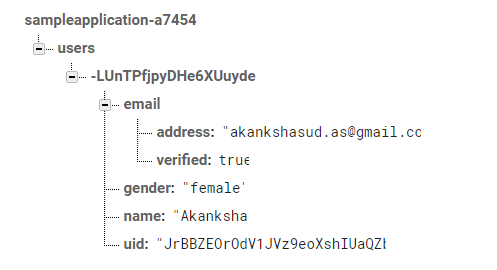

# Realtime Database

The Firebase Realtime Database is a cloud-hosted database. Data is stored as JSON and synchronized in realtime to every connected client. When you build cross-platform apps with our iOS, Android, and JavaScript SDKs, all of your clients share one Realtime Database instance and automatically receive updates with the newest data.

Data in Firebase is stored in the form of a JSON tree:


 
In order to begin using the Firebase database, do the initial steps as explained above.

## Writing to the database

Next, in order to write to the database, get a reference to the database:
 
```
private var mDatabaseReference: DatabaseReference? = null
private var mDatabase: FirebaseDatabase? = null
```
```
mDatabase = FirebaseDatabase.getInstance()
mDatabaseReference = mDatabase!!.reference!!.child("Users")
```

Now, in order to add the data first create a new node by using the push method. The push method assigns a unique key to the data value. Then obtain that key using .key and finally push your data at the key node by passing the data as a parameter to the setValue method.

```
val key =  mDatabaseReference!!.push().key
val user = User(firstName, lastName, email)
mDatabaseReference!!.child(key).setValue(user)
```
 
If the data passed is as object, then the contents of your object are automatically mapped to child locations in a nested fashion. 
You can also update a particular attribute of the object without having to rewrite the whole object. This can be done using the setValue method for the child node.

### Offline data
Every application that is connected to the Firebase, maintains its own local version of the data. In fact, the data that is pushed gets written to the local server first and is then synchronized with the server.
Therefore, the app will remain responsive even if the internet connection is not available at that particular moment. When the connection is re-established, then the client is synced with the current state of the server.

## Reading data from database

Reading from database requires listeners to be attached to the remote database. addListener is used to ‘listen’ to changes in the remote database, rather than just asking for them once. This allows the app to seamlessly stay connected with the changes in the database.

When working with lists, the application should listen for child events. Child events are triggered in response to specific operations that happen to the children of a node from an operation such as a new child added through the push() method or a child being updated through the updateChildren() method. Each of these together can be useful for listening to changes to a specific node in a database.

In order to listen for child events on DatabaseReference, attach a ChildEventListener. ChildEventListener has the following callback methods:

**1. onChildAdded():** 	Retrieve lists of items or listen for additions to a list of items. This callback is triggered once for each existing child and then again every time a new child is added to the specified path. The DataSnapshot passed to the listener contains the the new child's data.

**2. onChildChanged():**	Listen for changes to the items in a list. This event is fired any time a child node is modified, including any modifications to descendants of the child node. The DataSnapshot passed to the event listener contains the updated data for the child.

**3. onChildRemoved():**	Listen for items being removed from a list. The DataSnapshot passed to the event callback contains the data for the removed child.

**4. onChildMoved():**	Listen for changes to the order of items in an ordered list. This event is triggered whenever the onChildChanged() callback is triggered by an update that causes reordering of the child. It is used with data that is ordered with orderByChild or orderByValue.

Use the following code to read the data from database:

```
val childEventListener = object : ChildEventListener {
    override fun onChildAdded(dataSnapshot: DataSnapshot, previousChildName: String?) {
        // When new data is added, this function updates it to the list
        val data = dataSnapshot.getValue(User::class.java)
    }

    override fun onChildChanged(dataSnapshot: DataSnapshot, previousChildName: String?) {
        // A data has changed, this method updates the list with new values
        val newUser = dataSnapshot.getValue(User::class.java)
    }

    override fun onChildRemoved(dataSnapshot: DataSnapshot) {
       // A data has ben removed, using this method check if that data is present in the list and if it is there remove it from the list
        val userKey = dataSnapshot.key
    }

    override fun onChildMoved(dataSnapshot: DataSnapshot, previousChildName: String?) {
        // If a data changes the position, move the position of data accordingly
        val movedUser = dataSnapshot.getValue(User::class.java)
        val commentKey = dataSnapshot.key
    }

    override fun onCancelled(databaseError: DatabaseError) {
        Log.w(TAG, "postComments:onCancelled", databaseError.toException())
        Toast.makeText(context, "Failed to load comments.",
                Toast.LENGTH_SHORT).show()
    }
}
databaseReference.addChildEventListener(childEventListener)
```


